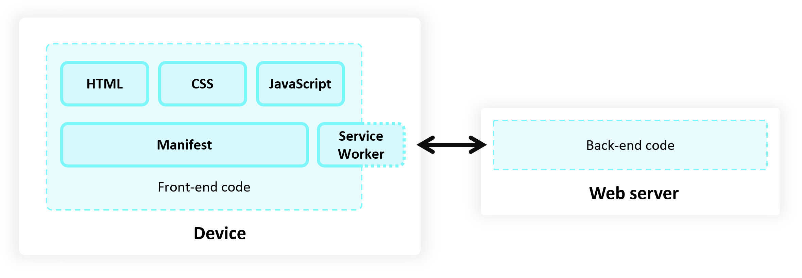
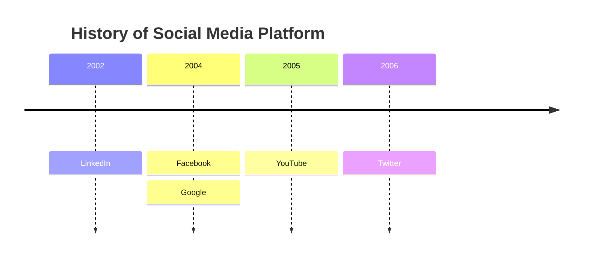

# pwa-portal

With it you get an app that:

- Has no build system to set up and no boilerplate code to add. Everything is included out of the box.
- Has a Service Worker system using [Workbox](https://developers.google.com/web/tools/workbox/)
- Scores close to 100 on Lighthouse out of the box
- Has everything needed to be installable in the browser
- Is ready to be package for the app stores using [PWABuilder](https://www.pwabuilder.com)
- Uses the [Azure Static Web Apps CLI](https://azure.github.io/static-web-apps-cli) which enables emulating your production environment locally, and gets you ready for deploying to Azure Static Web Apps!



[**Straight to Full Documentation**](https://docs.pwabuilder.com/#/starter/quick-start)

|                             |                                                                                                                                                                                    |
| --------------------------- | ---------------------------------------------------------------------------------------------------------------------------------------------------------------------------------- |
| IndexedDB                   | A client-side storage API for significant amounts of structured data, including files.                                                                                             |
| Badging API                 | A method of setting a badge on the application icon, providing a low-distraction notification.                                                                                     |
| Notifications API           | A way to send notifications that are displayed at the operating system level.                                                                                                      |
| Web Share API               | A mechanism for sharing text, links, files, and other content to other apps selected by the user on their device.                                                                  |
| Window Controls Overlay API | An API for PWAs installed on desktop operating systems that enables hiding the default window title bar, enabling displaying the app over the full surface area of the app window. |

## [ServiceWorker](https://developer.mozilla.org/en-US/docs/Web/API/Service_Worker_API)

Service workers are also intended to be used for such things as:

- Background data synchronization.
- Responding to resource requests from other origins.
- Receiving centralized updates to expensive-to-calculate data such as geolocation or gyroscope, so multiple pages can make use of one set of data.
- Client-side compiling and dependency management of CoffeeScript, less, CJS/AMD modules, etc. for development purposes.
- Hooks for background services.
- Custom templating based on certain URL patterns.
- Performance enhancements, for example, pre-fetching resources that the user is likely to need soon, such as the next few pictures in a photo album.
- API mocking.


```
{time period} : {event}
              : {event}
              : {event}
```



## Jump Right In

Install the PWABuilder CLI:

`npm i -g @pwabuilder/cli`

And create a new app with this command:

`pwa create`

And start your app locally with:

`pwa start`

And that's it! Good luck on your Progressive Web App adventure!

and all with just a few button clicks 😊.

## [PWA Stats](https://www.pwastats.com/)

## references

| Item                 | Link(s)                                                           |
| -------------------- | ----------------------------------------------------------------- |
| Progressive web apps | https://developer.mozilla.org/en-US/docs/Web/Progressive_web_apps |

